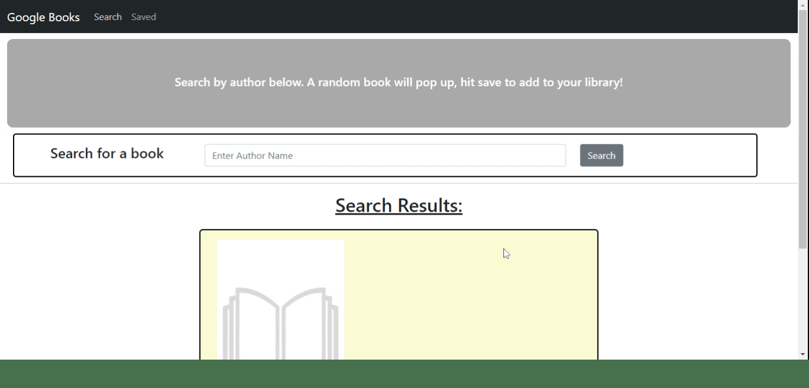

# Google Books Reading List

## Description of Project

This is a MERN project that allows users to search by author and receive a RANDOM book back written by that author.  If you like it, press save and add it to your reading list!

## Table of Contents

- [Usage](#usage)
- [Credits and Code Used](#credits-and-code-used)
- [Application Demo](#application-demo)
- [Questions](#questions)
- [Takeaways and Future Development](#takeaways-and-future-development)

## Usage
Check out the heroku deployed application [here!](https://frozen-tundra-81012.herokuapp.com/#/)

## Credits and Code Used

- JavaScript/ES6
- Node.js
- React
- Bootstrap
- npm packages (react, react-dom, bootstrap)
- Google Books API

## Application Demo

## Questions
Check out my GitHub profile [here.](https://github.com/smcmillan28)

Feel free to send me an email, as well: smcmillan1991@gmail.com

## Takeaways and Future Development

- The largest piece of future development for me will be to complete the save functionality. 
- What we want to do is give the user the ability to add and remove books from their library.
